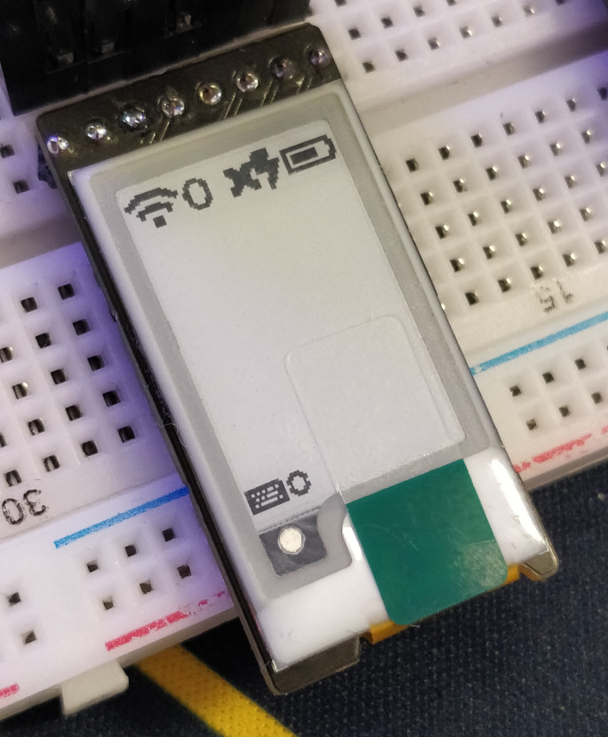

# 1.02 inch e-ink Display Module

This is an open-source e-ink or e-paper display module that's only 19.5mm x 38.5mm.

This module is made for the Good Display GDEW0102T4 1.02 inch e-ink display, which [Waveshare resells](https://www.waveshare.com/product/displays/e-paper/epaper-3/1.02inch-e-paper-module.htm). This is a slimmed down version of the Waveshare module without the logic translation circuitry, which means this must be run at 3.3V.

## Ordering from JLCPCB and LCSC

This module is ready to be (almost fully) assembled. You'll need three files, `gerbers.zip`, `epaper-102-bom.csv`, and `epaper-102-bottom-pos.xlsx`.

1. Go to [JLCPCB.com](https://cart.jlcpcb.com/quote?orderType=1) quote page
2. Upload the `gerbers.zip` file to the quote page
3. Select any options you would like. PCB Color must be Green or Black and thickness must be 1.6mm
4. Check SMT Assembly under the PCB section
5. Select "Assemble bottom side"
6. Agree to terms and click Confirm
7. Add `epaper-102-bom.csv` as the BOM file and `epaper-102-bottom-pos.xlsx` as the CPL file on this page. Click Next
8. All parts on this page should be found automatically besides the FFC (ribbon cable) connector. Click next
9. Confirm placements look good (they should be fine) and click "Save to Cart"
10. Checkout when you're ready

Unfortunately JLCPCB does not assemble the FFC (ribbon cable) connector. You'll need to order them separately from LCSC and assemble that part yourself.

Order part [C262294 from LCSC](https://lcsc.com/product-detail/FFC-FPC-Connectors_JUSHUO-AFC24-S30FIC-00_C262294.html). Might as well get a few extra since they're so cheap and shipping is most of the cost.

Now you've ordered all the parts necessary for the module!

## Ordering the display

You'll also need the actual 1.02 inch e-ink display to put in the module. You can order them from one of the following places:

 - [Waveshare](https://www.waveshare.com/product/displays/e-paper/epaper-3/1.02inch-e-paper.htm)
 - [AliExpress](https://www.aliexpress.com/item/4000504958641.html)
 - [Alibaba](https://goodlcd.en.alibaba.com/product/62454456237-807321088/1_inch_small_epaper_mini_eink_display_for_smart_watch.html)

I found AliExpress to be the cheapest in terms of display price and shipping, but you should check for yourself.

## Assembling

Once all your parts have arrived, you'll need to solder on the FFC (ribbon cable) connector and then insert the display.

#### Attaching the FFC Connector

To attach the FFC connector, I recommend you first tin all of the small pins and ignore the larger mounting pads as they're mostly unaccessible when hand soldering.

Once the pads are tinned, you can place the connector on the board and then reheat the tinned pads to make the connection complete.

You may need to add more solder, but don't add too much! Just a little too much and you'll have a pain to fix up without solder wick. 

Flux will be your friend here. If you don't have any flux, do consider getting some, as it will make your life much easier.

#### Connecting the display

This is the easy part. Once the FFC connector is on, pull up on the lever, and insert the display into the connector with the gold pins facing away from the PCB. Once it's all the way in, push the lever back down to lock it in place.

Now your module is all ready to go. You may want to use a bit of tape or adhesive to make sure the display sticks in place.
